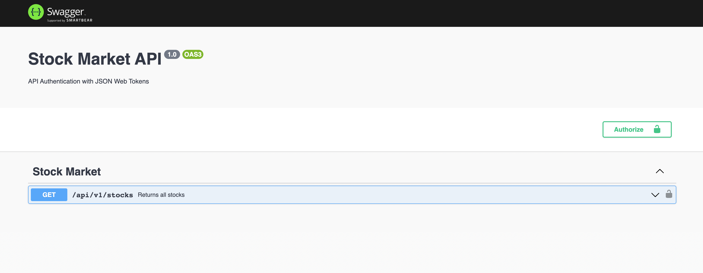
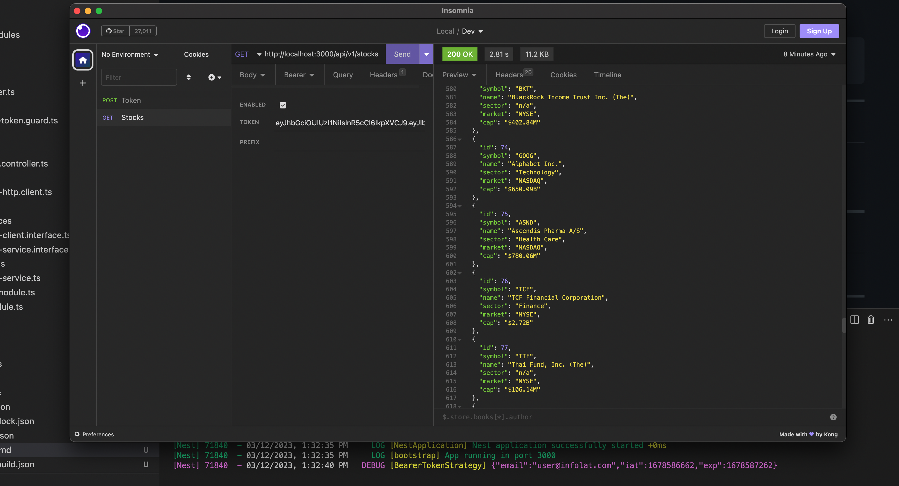

# Stock API

REST API that validate an access token with `@nestjs/passport` strategy.

## Table of Content

- [Description](#description)
- [Technology Stack](#technology-stack)
- [Local Installation](#local-usage)
- [Usage](#usage)
- [License](#license)

---

## Description

REST API with `NestJS` that validate an access token and get a list of stocks



---

## Technology Stack

The core technology stack in this project is based on NestJS framework.

- `node`: v19.7.0
- `npm`: 9.5.0
- `nestjs`: 9.2.0

For the complete list of dependencies refer to `Package.json` file.

---

## Local Usage

In this section you will see the tools required and steps to setup development environment for this project.

### **Installation**

Download the installer: https://nodejs.org/en/download/

1. Verify the Node.js installation with the following command:

```bash
node --version
```

2. Clone the project repository
3. Go into the project root folder
4. Run `npm i` to install project dependencies

```bash
npm i
```

### Run Locally

#### Start the API

```bash
# development
$ npm run start:dev
```

### Test

```bash
# unit tests
$ npm run test
```

---

## Usage

#### Calling the API

- `GET`: http://localhost:3000/api/v1/stocks



#### Generate an access token

You can generate an access token running this project:

- https://github.com/eromerodev/nestjs-jwt-service

---

## License

MIT

<hr />
<div align="center">
    <samp>Happy Hacking!😎</samp>
</div>
